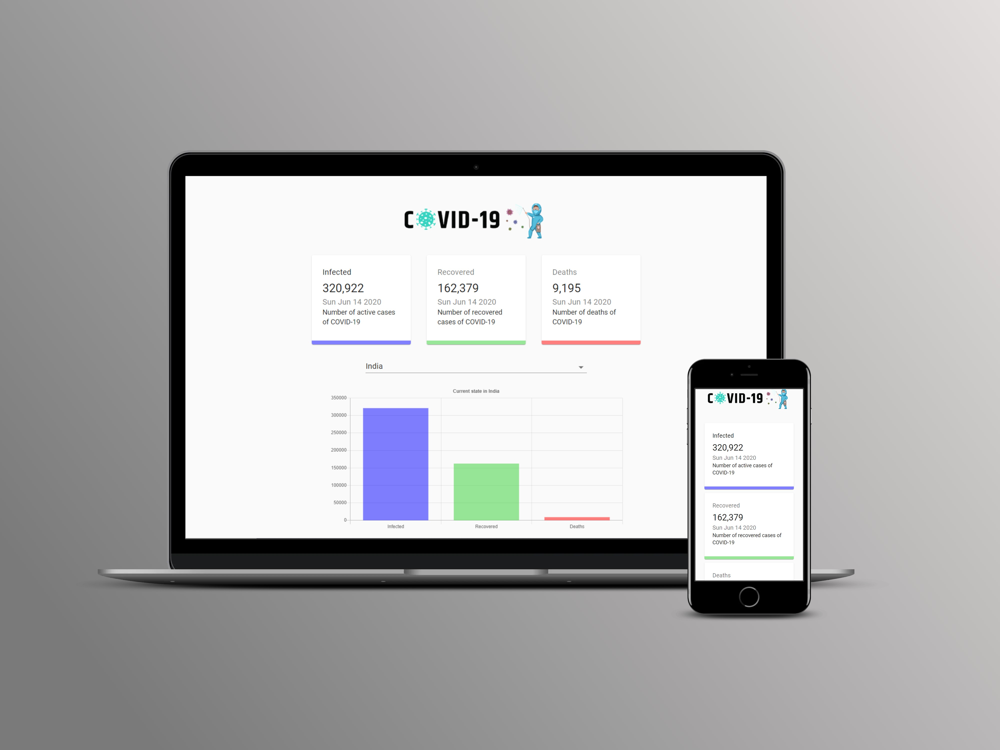

#App Preview:

#Packages:
axios --> To make GET Requests to the API
react-chartjs-2 --> To make beautiful reat charts 1st install --> npm i --save chart.js
react-countup --> To make counter animation
classnames --> classNames function takes any number of arguments which can be a string or object.

@material-ui/core --> Material UI for Styling
React components for faster and easier web development. Build your own design system, or start with Material Design.

modules.css --> If we do not use this modules then all the saas from here gets applicable to all the other components and there will be a chance of interference

#Components:
Line Chart --> Global Data
Bar Chart --> Country Data
FormControl and NativeSelect form Material-UI

#FS
Only App.js is a class based component
